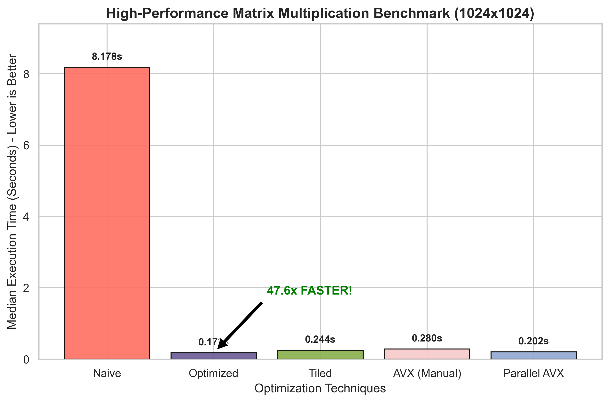

# ⚡ High-Performance Matrix Multiplication Engine (HPC)


> **"Optimizing beyond the Compiler's limits."**

This project implements a highly optimized Matrix Multiplication engine. Unlike standard implementations that rely on compiler auto-vectorization, this project utilizes **Manual SIMD Intrinsics (AVX2)** and **Multithreading** to squeeze every bit of performance from the CPU.

Achieved a **47.64x Speedup** on a Linux x86_64 environment (AMD EPYC 9V74 80-Core) with verified correctness checks.

---

## 🏎️ Performance Benchmarks (1024x1024)

Benchmarks recorded natively on **Linux x86_64 (AMD EPYC 9V74 80-Core Processor)**.
*(Note: Median execution time over 5 runs with strict max absolute difference correctness checking)*

| Optimization Level | Median Time | Speedup | Technical Breakdown |
| :--- | :--- | :--- | :--- |
| **1. Naive** | `8.178 s` | 1.0x | Baseline $O(N^3)$ algorithm. Heavy cache misses. |
| **2. Optimized** | **0.171 s** | **47.64x** | **Loop Reordering (`i-k-j`)**: Maximizes Spatial Locality. |
| **3. Tiled** | `0.244 s` | 33.47x | **L1 Cache Blocking**: 64x64 tiles to prevent Cache Thrashing. |
| **4. AVX2 (Manual)** | `0.280 s` | 29.17x | **Explicit Vectorization**: Using `_mm256_fmadd_pd` manually. |
| **5. Parallel AVX** | `0.202 s` | 40.41x | **Multithreading**: `std::thread` pool with AVX2 kernels. |

### 📊 Visual Analysis


---

## 🧠 Why This Project is Different?

Most optimizations rely on the compiler to "Auto-Vectorize" code. This project goes a step further by using **Hardware Intrinsics**:

### 1. Manual AVX2 Implementation (`immintrin.h`)
Instead of hoping the compiler optimizes the math, I explicitly mapped data to **256-bit YMM Registers**.
* **Instruction:** `_mm256_fmadd_pd` (Fused Multiply-Add).
* **Throughput:** Processes **4 Double-Precision** numbers in a single CPU cycle.

### 2. Cache-Aware Tiling
Implemented **Block Matrix Multiplication** with a tile size of `64`. This ensures that the working set fits entirely inside the **L1 Cache** (32KB-64KB), reducing expensive RAM fetches by order of magnitude.

### 3. Lock-Free Parallelism
Used `std::thread` with a lambda-based worker model. The matrix is sliced row-wise (`startRow` to `endRow`), ensuring **Zero Race Conditions** without needing Mutex locks (which slow down performance).

---

## 💻 How to Run

### Prerequisites
* **CPU:** Intel/AMD with AVX2 Support.
* **Compiler:** GCC (g++) or Clang.
* **OS:** Linux/WSL.

### Build & Benchmark
```bash
# Compile with O3 optimizations, AVX2 flags, and pthread linking
g++ -O3 -mavx2 -mfma -pthread main.cpp -o matrix

# Run the engine
./matrix

---

## 👨‍💻 Author

*Mohit Prajapati*
*High-Performance Computing & Systems Engineering Enthusiast*