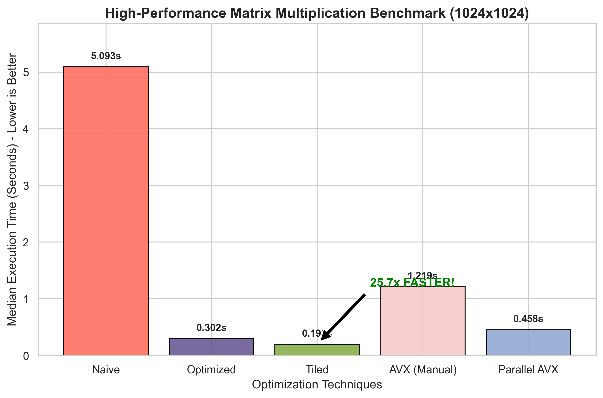

# High-Performance Matrix Multiplication (AVX2, C++17)

[](https://github.com/mohitt31/High-Performance-Matrix-Multiplication/actions)
[](LICENSE)

Dense `1024×1024` matrix multiplication, built up in stages from a naive triple loop to a cache-blocked, AVX2/FMA, multithreaded kernel, with correctness checked at every stage.

## Results (1024×1024, double precision)

Measured on GitHub's hosted `ubuntu-latest` runner (Intel Xeon Platinum 8272CL @ 2.60GHz), median of 3 CI runs, correctness verified against the naive result at every stage (max abs diff = 0.0 for all). Raw data: [`results.csv`](results.csv), reproduced on every push via [`.github/workflows/benchmark.yml`](.github/workflows/benchmark.yml).

| Stage | Median time | Speedup vs naive | What changed |
|---|---:|---:|---|
| Naive | 4.472 s | 1.0× | Baseline O(N³), `i-j-k` order |
| Loop-reordered | 0.302 s | 14.8× | `i-k-j` order for spatial locality |
| Cache-blocked | 0.231 s | 19.3× | 64×64 tiles sized to fit L1 |
| AVX2 (manual) | 0.220 s | 20.3× | Explicit `_mm256_fmadd_pd`, `i-j-k` accumulation |
| Parallel AVX2 | 0.059 s | **75.2×** | `std::thread` pool, row-sliced, no locks |

## A real finding: manual AVX2 was initially *slower* than auto-vectorized code

The first version of the manual-intrinsics kernel used the same `i-k-j` loop order as the scalar version, and it underperformed plain `-O3` auto-vectorization. The cause: `i-k-j` forces the AVX kernel to load and store the accumulator into `C` on every iteration of `k`, turning it into a memory-bound loop. Switching the manual-intrinsics path to `i-j-k` accumulation — load `C` into a YMM register once, accumulate across all of `k`, store once — fixed it. This is the kind of thing that's easy to get backwards when hand-vectorizing, and worth stating plainly rather than only showing the final numbers.



## Build & run

Requires an x86-64 CPU with AVX2 + FMA and a compiler with `pthread` support.

```bash
g++ -O3 -mavx2 -mfma -pthread main.cpp -o matrix
./matrix
```

CI also runs a ThreadSanitizer build (`-fsanitize=thread`) to check the row-sliced parallel kernel for races.

## Scope and caveats

- Single square size (1024×1024), double precision, one CPU (GH Actions runner). No sweep over matrix size, no comparison against a reference BLAS (OpenBLAS/MKL). The baseline here is the naive triple loop, not a production GEMM.
- Correctness is checked by comparing every optimized stage's output to the naive result (`main_test.cpp`), not by an independent reference.

## Author

Mohit Prajapati
